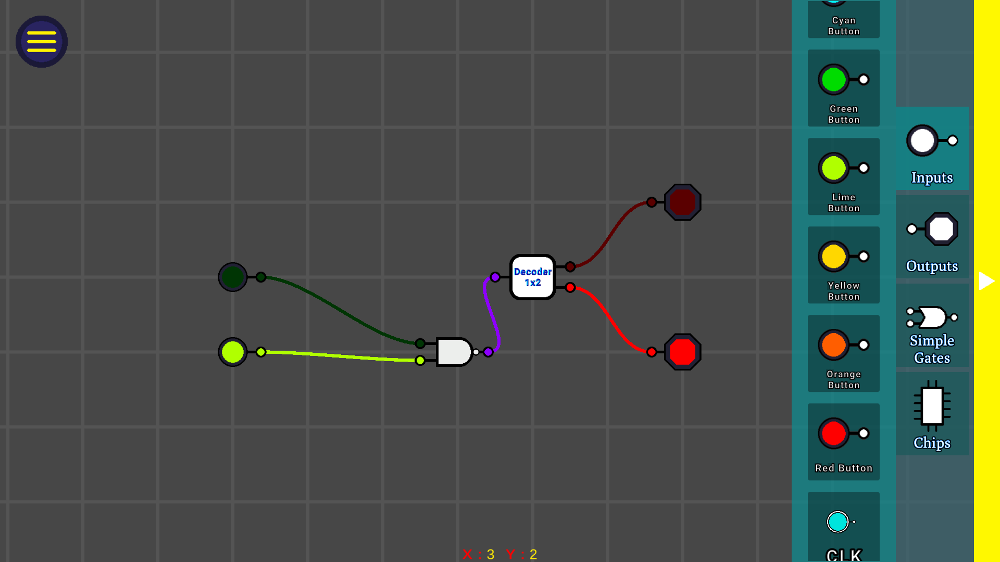
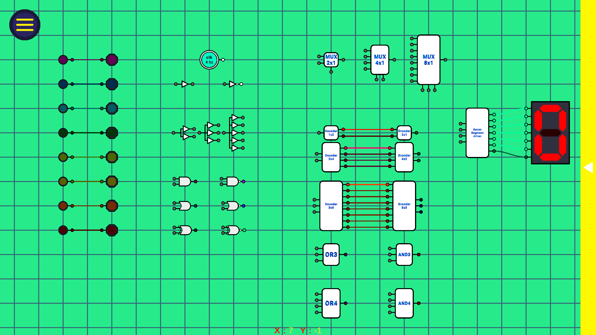
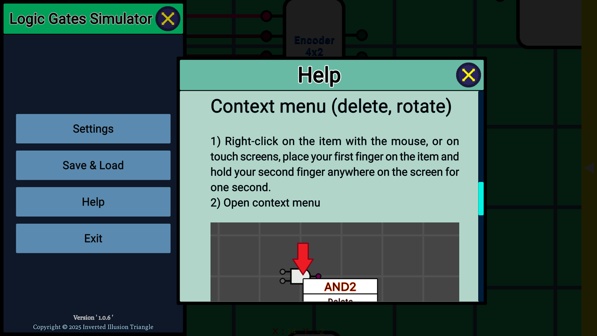
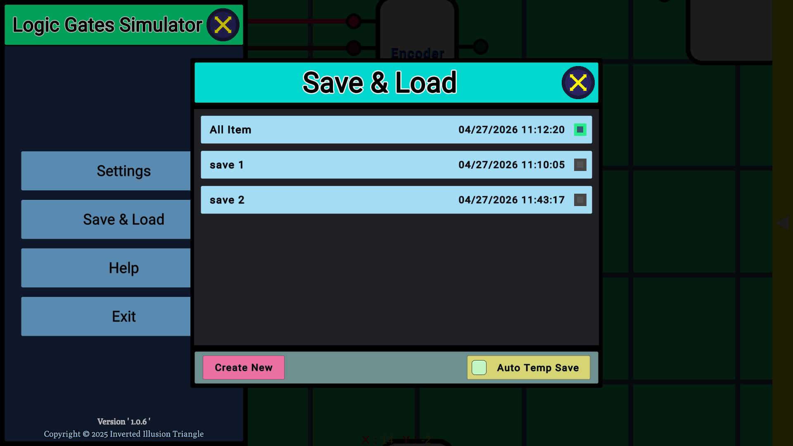

# Logic Gates Simulator

A Unity-based interactive logic gate simulator that allows users to design, build, and test digital logic circuits with a comprehensive suite of fundamental logic gates and components.

## Overview

**LogicGateSim** is an educational and experimental project designed to provide an intuitive visual interface for creating and simulating digital logic circuits. The project leverages the power of the Unity game engine to deliver an interactive, real-time logic gate simulation experience.

## Demo Video

[Download Demo](./Others/Demo.mp4)

## Screenshots










## Releases

[Windows x64 setup](./Others/Setup.exe)

---

### 🎯 Core Logic Gates

The simulator includes implementations of all fundamental logic gates:

- **Buffer** - Signal passthrough gate
- **NOT** - Logical inversion (NOT gate)
- **AND2** - Two-input AND gate
- **NAND2** - Two-input NAND gate
- **OR2** - Two-input OR gate
- **NOR2** - Two-input NOR gate
- **XOR2** - Two-input XOR (exclusive OR) gate
- **XNOR2** - Two-input XNOR (exclusive NOR) gate

### ⚙️ Advanced Architecture

- **GateBase System** - Extensible base class for all logic gate implementations
- **Pin Management** - Sophisticated input/output pin management system with support for wiring
- **Logic Update System** - Real-time logic state propagation and event handling
- **Rotation & Positioning** - Gates can be rotated and positioned in any orientation (North, East, South, West)

### 🖌️ Interactive Features

- **Visual Gate Wiring** - Connect logic gates together through an intuitive interface
- **Real-time State Display** - Color-coded visual feedback showing signal states (On/Off)
- **Gate Rotation** - Support for rotating gates in 90-degree increments
- **Customizable Colors** - Configurable on/off state colors for visual distinction
- **Item System** - Scriptable object-based gate and component system for easy expansion

### 🌍 Internationalization

- **RTL (Right-to-Left) Text Support** - Full support for right-to-left languages including Farsi and Arabic
- **RTLTextMeshPro Integration** - Integration with TextMeshPro for enhanced RTL rendering
- **Localization System** - Multi-language support with locale switching capabilities

### 📱 Platform Support

- **Android** - Optimized for Android devices with adaptive FPS targeting
- **Cross-Platform** - Supports multiple desktop and mobile platforms via Unity

---

## Project Structure

```
Assets/
├── (__Scripts__)/
│   ├── Logic Scripts/
│   │   ├── Simple Gates Scripts/      # Individual gate implementations
│   │   ├── Chips Scripts/             # Complex IC chip components
│   │   ├── GateBase.cs                # Base class for all gates
│   │   └── LogicHelper.cs             # Logic operation utilities
│   ├── GameManagent Scripts/
│   ├── UI Scripts/                    # User interface components
│   └── (_Other_CSharp_Library_)/      # Utility libraries
├── (__Scriptable Objects__)/
│   └── Scripts/Item.cs                # Gate and component items
└── Assets/                            # Game assets and prefabs
```

---

## Technical Details

### Key Technologies

- **Unity Engine** - Game development and simulation framework

### Architecture Highlights

- **Interface-Based Design** - Uses interfaces like `IWirable`, `IBorderable`, `IColorable`, `ILogicHandler` for flexible component composition
- **State Pattern** - `LogicState` enum (On, Off, None) for gate signal representation
- **Singleton Pattern** - `LogicUpdater` manages real-time logic state updates
- **Manager Pattern** - `PinManager` handles complex pin connections and wiring

---

## Usage

### Building Logic Circuits

1. **Select a Gate** - Choose from the available logic gate components
2. **Place & Rotate** - Position gates on the canvas and rotate as needed (N, E, S, W orientations)
3. **Connect Inputs/Outputs** - Wire gate outputs to other gate inputs
4. **Set Input States** - Configure input signal states (On/Off)
5. **Observe Results** - Watch real-time logic state propagation and output signals

### Example: Creating an AND Gate Chain

```
Input1 ──┐
         ├──> AND2 ──┐
Input2 ──┘           ├──> OR2 ──> Output
                     │
Input3 ──────────────┘
```

---

## Getting Started

### Prerequisites

- **Unity Engine** (2020 LTS or later recommended)
- **C# 8.0+** language support
- Basic understanding of digital logic circuits

### Installation

1. Clone the repository
2. Open the project in Unity
3. Navigate to the Scenes folder and open the main simulation scene
4. Press Play to start the simulator

### Building for Android

```csharp
// The project includes Android-specific optimizations
// FPS automatically adjusts based on device refresh rate
```

---

## Extensibility

### Adding New Gates

To add a new logic gate:

1. Create a new C# class inheriting from `GateBase`
2. Implement the `HandleLogic()` method
3. Configure input/output pins via `PinManager`
4. Create a Scriptable Object entry in the item system
5. Add the prefab to the scene

### Example

```csharp
public class MyCustomGate : GateBase
{
    public override void HandleLogic()
    {
        IWirable inputA = _pinManager.GetInputPin_IWirable(0);
        IWirable outputPin = _pinManager.GetOutputPin_IWirable(0);
        
        // Custom logic here
        outputPin.LogicState = inputA.LogicState;
    }
}
```

---

## Performance

- **Real-time Logic Updates** - Efficient state propagation system
- **Adaptive FPS** - Automatically optimizes frame rate based on platform
- **Memory Efficient** - Scriptable objects reduce memory footprint
- **Shader Optimization** - Optimized ShaderLab implementations for smooth rendering

---

## Localization

The simulator supports multiple languages with RTL text support:

- English
- Farsi (Persian)
- Arabic
- Additional languages can be added via the localization system

---

## License

Copyright © 2023-2025 Inverted Illusion Triangle. All rights reserved.

See `LICENSE.txt` for full license details.

---

## Development

**Created by**: Heuristic-alpha   
**Status**: Active Development  
**First Commit**: February 7, 2025

---

## Roadmap & Future Enhancements

- [ ] Advanced IC chip support (multiplexers, decoders, flip-flops)
- [ ] Circuit save/load functionality
- [ ] Circuit validation and error detection
- [ ] Tutorial system and guided learning paths
- [ ] Performance profiling tools
- [ ] Export circuits as images or diagrams
- [ ] Web-based version for broader accessibility

---

## Contributing

Contributions are welcome! Please feel free to submit issues, feature requests, or pull requests to help improve the Logic Gate Simulator.

---

## Support & Documentation

For issues, questions, or suggestions, please open an issue on the GitHub repository or contact the project maintainers.

---

**Happy Simulating! 🎓⚡**
